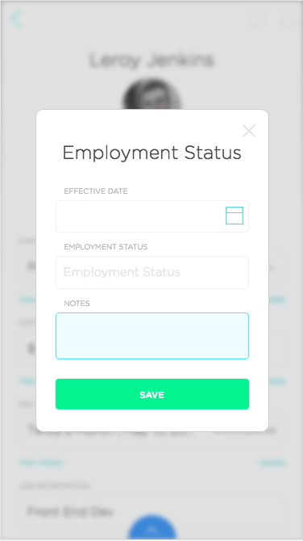
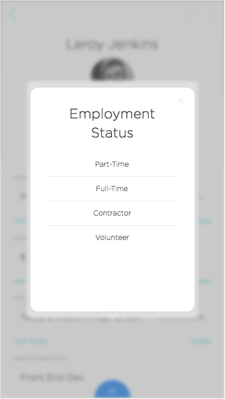
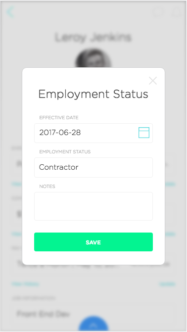

# SimpleFrontEndPractice
Used Create-React-App to get started. https://github.com/facebookincubator/create-react-app

Given some pictures and attempted to recreate the look and feel of the front end dialog boxes. 

To get started and check it out clone this repo
`git clone repoName`

Change your directory to in Terminal or whatever you are using to `my-app` folder

Now run `npm start` or `yarn start` (this assumes you already have node installed on your machine)

Lastly go to `http://localhost:3000` to see it working!
